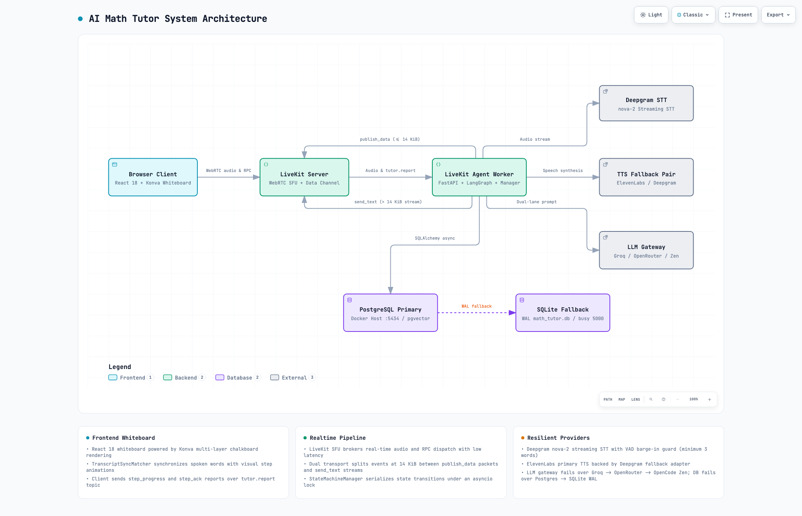
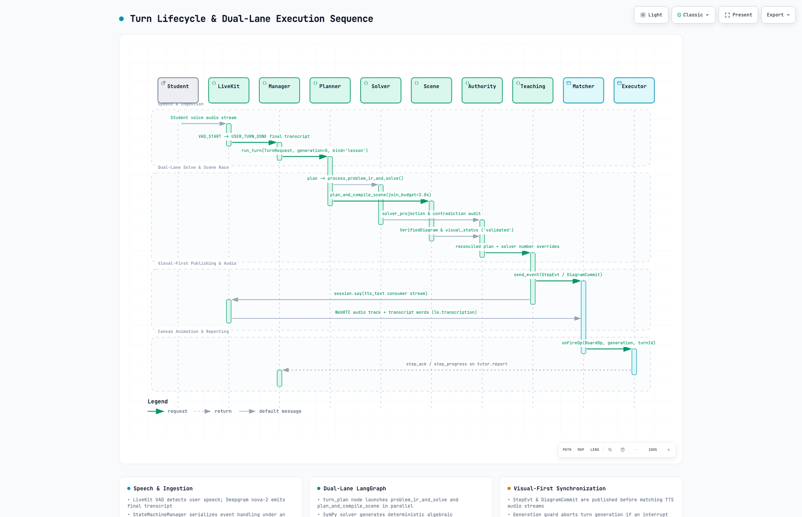
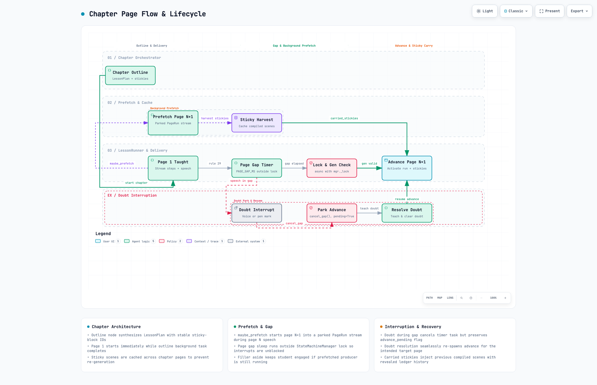

# Architecture & flow diagrams

Interactive diagrams of the tutor's architecture, turn lifecycle and chapter lesson flow. Each
diagram is a **single self-contained HTML file** — inline CSS, JavaScript and SVG with embedded
images/fonts and no external assets — so it opens in any browser with no server and no internet.

> GitHub shows an `.html` file as source code, not as a rendered page. Use the **interactive** links
> below (download/open the file, or view it through GitHub Pages), or read the PNG previews embedded
> here, which GitHub renders inline.

## 1. System architecture — `01-system-architecture.html`

[Open the interactive diagram](01-system-architecture.html)



## 2. Turn lifecycle sequence — `02-turn-lifecycle-sequence.html`

[Open the interactive diagram](02-turn-lifecycle-sequence.html)



## 3. Chapter page flow — `04-chapter-page-flow.html`

[Open the interactive diagram](04-chapter-page-flow.html)



## Conversation state lifecycle

`03-conv-state-lifecycle.json` holds the conversation state/event definitions. It is data only — it
has no rendered diagram.

---

### Viewing the interactive versions

- **Local**: open the `.html` file in a browser, or serve the folder:
  ```bash
  cd docs/diagrams && python3 -m http.server 8000
  # then open http://localhost:8000/01-system-architecture.html
  ```
- **GitHub Pages**: with Pages enabled for this repository (`main` branch, `/docs` folder), the same
  files are served at `https://<owner>.github.io/<repo>/diagrams/<file>.html`.

The `*.visual-check.*.png` images are fixed-size screenshots of each diagram (dark/light, two
resolutions); the `*.visual-check.html` files are small pages that lay those screenshots out
side by side.
